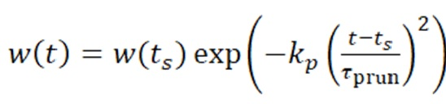
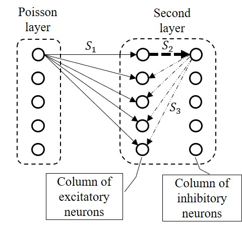
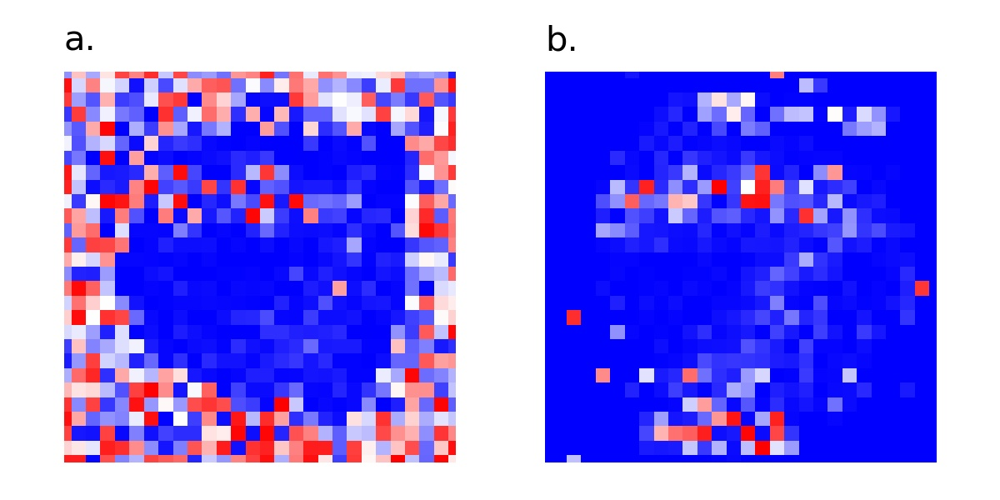

# __Weight regularization in spiking neural networks__    
The code illustrates [the result reported at the XXXII All-Russian workshop 'Neuroinformatics, its applications and data analysis'](https://www.researchgate.net/publication/384485253_Weight_regularization_in_spiking_neural_networks) at Akademgorodok, Krasnoyarsk, Russia.

### ARTICLE:
Antonov D.I., Sukhov S.V. "Weight regularization in spiking neural networks." Proceedings of XXXII All-Russian workshop 'Neuroinformatics, its applications and data analysis'. Krasnoyarsk. Russia. 2024. pp.10-17. 
***
Abstract:    
The desired result of any learning of an artificial neural network is the ability to generalize knowledge to solve new problems. However, mindless minimization of the loss function may result in overfitting of the model. Overfitting is a result of training taking into account both essential and insignificant features, noise. Regularization methods are intended to minimize the influence of random noise and to identify regular features. There are many regularization methods for 2nd generation artificial neural networks (L1 regularization, L2 regularization, dropout, etc.). But these conventional regularization methods are not suitable for spiking neural networks. This paper presents a new technique for regularizing weights in spiking neural networks.    
***
We propose the weight regularization method for SNNs based on the biological __‘use it or lose it’__ concept:          
* if a synaptic connection is not used in a brain, it is pruned. 

To ensure the pruning of unnecessary weight in SNNs, all the weights become time-dependent:

***  
About used architecture of spiking neural network see my repo [__learning_rule_STDP_all-LTD__](https://github.com/dmitryanton68/learning_rule_STDP_all-LTD/tree/main/)   

  

***
To test our regularization concept, we perform a series of experiments with SNNs. In experiments, the SNN is trained with the aim of classification of MNIST images of handwritten digits. The purpose of the experiments was to compare the SNN output activity with or without weight regularization. The SNN in all the experiments uses _the leaky integrate-and-fire_ neurons with _an adaptive threshold_ for excitatory neurons.     

To study the effects of regularization, the trained networks were tested on four different datasets with 1500 images each:
1.	  pixel images with delta-correlated noise with an average intensity equal to the average intensity of the images in the training dataset;
2.	  pixel noise images processed with a Gaussian filter with a standard deviation of 2 pixels (finite-correlation noise images);
3.	images of the digits corresponding to the same classes the network was trained on;
4.	images of the digits different from the classes the network was trained on.    

The elimination of the insignificant synaptic weights that are not involved in recognition is expressed in a decrease in the overall neural activity of the SNN when it is tested on images of both ‘known’ (image classes coincide with those used in training) and ‘unknown’ digits (see Table).

__Table__
_Neuronal output activity (total number of spikes) for different datasets_

|No|Test set|Model without regularization|Model with regularization|
| :-: | :-: | :-: | :-: |
|1|Delta-correlated noise|3162|1|
|2|Gaussian blurred images|3265|1|
|3|‘Known’ digits|416|344|
|4|‘Unknown’ digits|346|240|    

The result of training with and without weight regularization is illustrated in Fig.

Fig.  784 weights of the synaptic group S1, associated with one of the excitatory neurons:    
a. in the model without regularization technique;    
b. the same weights in the model with regularization
